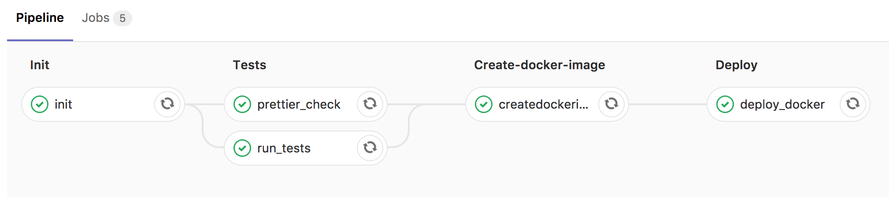

# GitLab + docker + LetsEncrypt CI/CD

This guide will help you setup a full **automated private dev environment with continuous integration and deployment** infrastructure, using open-source tools.

The host machine just needs docker, in which all containers will be instantiated.

You'll need a wildcard domain alias pointing to your host machine, so your apps can be deployed on `*.your.domain.com`.

:warning: if you want to deploy your apps with https, the main host must be accessible from the internet via `http` to allow the initial LetsEncrypt ACME challenge verification.

:warning: we assume this is a private infra so the setup security is not addressed. Please do submit issues if you have suggestions.

## Features

 - GitLab : store your code, run pipelines
 - Docker : runs all containers
 - Rancher : docker infrastructure supervision
 - LetsEncrypt : automagically get SSL certs for your deployments when needed
 - nginx : ReverseProxy for your published containers

## Sample project

We'll use the sample NodeJS application in the [app](./app) folder.

The app has a [.gitlab-ci.yml](./app/.gitlab-ci.yml) that use GitLab CI :

 - run JEST tests on the code
 - run prettier-check
 - run code coverage
 - build a docker image
 - publish docker image to registry
 - deploy the docker image in our infra for review
 - optionnaly generate LetsEncrypt SSL certs



## Initial Setup

I broke the infra in several containers groups

### nginx RP

Use [docker-compose-nginx.yml](./docker-compose-nginx.yml) to create containers for the nginx proxy. We use [letsencrypt-nginx-proxy-companion](https://github.com/JrCs/docker-letsencrypt-nginx-proxy-companion) that automate the nginx vhosts configuration and create SSL certs as needed.

Once the containers are ready, you can add containers to your infra just like this :

```sh
docker run -d \
  --name example-app \
  -e "VIRTUAL_HOST=whoami.test.revolunet.com" \
  -e "VIRTUAL_PORT=8000" \
  -e "LETSENCRYPT_HOST=whoami.test.revolunet.com" \
  -e "LETSENCRYPT_EMAIL=contact@revolunet.com" \
  --network="nginx-proxy" \
  jwilder/whoami
```

This will make `https://whoami.test.revolunet.com` available, with SSL certs from LetsEncrypt. Just remove the `LETSENCRYPT_*` variables if you dont need SSL.

You need to have [nginx.tmpl](https://github.com/jwilder/nginx-proxy/blob/master/nginx.tmpl) file in the host `/root/docker/nginx.tmpl`.

### gitlab

Use [docker-compose-gitlab.yml](./docker-compose-gitlab.yml) to create containers for GitLab, gitlab-runner and a docker registry.

You then need to register the gitlab runner :
 - open GitLab admin page to get the runner endpoint and token
 - [register](https://docs.gitlab.com/runner/register/) the runner to GitLab from the host : `docker exec -it gitlab-runner gitlab-runner register`

:warning: as our main host may have port 22 used for its own SSH, we need to use another port for the GitLab ssh, where devs will push their code. Here we use port 24, so devs needs to add this to their `~/ssh/config` :

```sh
host gitlab.your.domain.nom
  hostname gitlab.your.domain.nom
  user git
  port 24
```

now, a single `git push` will hit GitLab and trigger CI/CD when `.gitlab-ci.yml` is present.

### rancher

Use [docker-compose-rancher.yml](./docker-compose-rancher.yml) to create the rancher container.

You can then use the Rancher UI to monitor your infrastructure, deploy new containers...

### Todo :

 - add prometheus performance regression monitoring